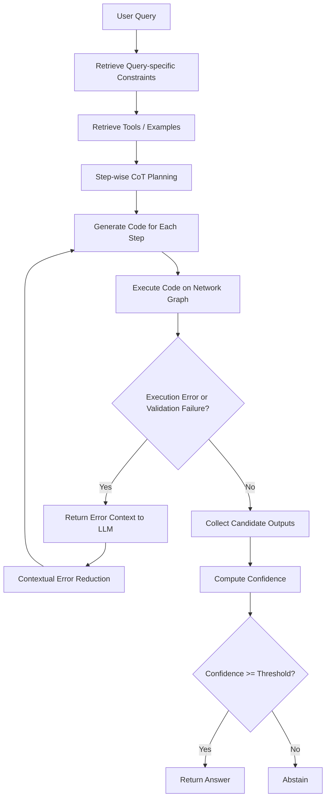

# MeshAgent 在 MALT 任务上的复现实验报告

## 摘要

本次任务，我复现的对象是论文 *MeshAgent: Enabling Reliable Network Management with Large Language Models* 里的MALT部分。简单来说，MALT让模型根据自然语言网络管理问题生成 Python 代码，在 NetworkX 图上完成查询、更新、删除、容量统计、拓扑调整等操作，最后把代码执行结果和标准答案对比。

我的复现思路是先把原始代码跑通，再补齐本地检索、重复运行、日志保存、confidence、abstain 和更细的 validation，最后再在这些结果上做改进实验。

目前结果最明显的一点是：**MALT 任务非常依赖 constraints，而且约束检索方式本身也会影响结果**。在前 50 个 query 单次运行的组件消融中，无约束只有 30.00%，全量约束达到 82.00%，旧版 query-specific constraints 为 78.00%，改成 Paper-style Hybrid/RRF 检索后达到 86.00%。之后我实现了更接近论文流程的 Paper-style Full MeshAgent，在 50 个 query、每题 3 次运行下，raw accuracy 为 84.67%，reliable accuracy 为 92.13%。后续我又做了增强 validation 的离线诊断，发现更严格的后置 validation 可以减少错答，但它不是一个独立的在线 agent 版本。

这篇报告的定位是说明我如何理解论文、如何阅读和改造原始 `app-malt` 项目、如何配置本地 RAG/FAISS/API 环境、如何设计实验，并在 MALT 前 50 题子集上复现和改进 MeshAgent 的关键运行机制。

## 1. 我对论文以及项目的理解
### 1.1 MeshAgent 的核心思想

我对 MeshAgent 的理解是：它不是单纯换了一个更长的 prompt，而是把网络管理中的结构化知识变成 constraints，然后让这些 constraints 同时参与检索、生成、执行检查和错误修复，进而解决稳定度和可信度的问题。

一个理想的 constraint 不只是自然语言提示，而应包含三部分：

| 组成 | 含义 |
|---|---|
| `label` | 约束名称，用于检索和定位 |
| `invariant` | 约束本身，即网络图或任务必须满足的不变量 |
| `validation test` | 可执行的检查函数，用于判断生成代码或执行结果是否违反约束 |

**但是这一部分没有在代码中体现**

所以 MeshAgent 真正关键的地方不是“给模型多塞一些背景知识”，而是把任务知识变成**可检索、可注入、可检查、可反馈的闭环**。这个理解也影响了我后面的改进方向：只做 prompt 增强是不够的，必须把 validation 也补起来。


### 1.2 论文中的运行时流程

论文中 MeshAgent 的整体流程可以概括为：



这个流程中有几个关键点：

1. **Query-specific constraint retrieval**：不同 query 只检索相关约束，而不是每次都塞入全部约束。
2. **Step-wise generation**：复杂任务先被拆成多个步骤，再逐步生成和执行代码。
3. **Validation test**：执行没有报错不代表答案合法，还需要检查是否违反图结构和任务约束。
4. **Contextual error reduction**：如果执行或验证失败，需要把 query、step、constraints、代码和错误原因反馈给 LLM，让它重新生成。
5. **Confidence and abstention**：不是所有生成结果都直接返回。系统会基于候选结果一致性、错误检查和 debug 轮数计算置信度，低置信结果拒答。


### 1.3 MALT 任务是什么

这一次复现我选择 MALT，即 **Network Lifecycle Management** 场景作为主要复现对象，**原因主要有以下几点。**

首先，MALT 能够较完整地体现 MeshAgent 的核心思想。MeshAgent 的关键大模型根据自然语言 query 生成图操作代码，并利用领域 constraints 和 verifier 检查结果是否可靠。**MALT 场景中的任务天然具有明显的图结构特征**，例如 JUPITER、SUPERBLOCK、AGG_BLOCK、CHASSIS、PACKET_SWITCH、PORT 等节点之间存在严格的层级关系，边表示 contains 或 controls 等关系。因此，MALT 非常适合验证 constraints-guided code generation 的有效性。

其次，MALT 不只是简单的图查询任务，还包含图修改任务。**这些任务既包括查询、统计，也包括删除、更新和拓扑调整，能够覆盖 MeshAgent 中的多个关键模块。**

模型需要根据自然语言问题生成一个 `process_graph(graph_data)` 函数，并在图上执行。例如：

- 列出某个 packet switch 下包含的所有 port；
- 修改某个 port 的 `physical_capacity_bps`；
- 统计每个 `AGG_BLOCK` 的带宽；
- 新增一个 packet switch 及其 ports，并补齐节点类型和边；
- 删除或迁移网络实体，使容量或连接关系满足特定条件。

**MALT 对约束检查的需求更强。**MALT 中很多错误并不是代码无法运行，而是代码运行后生成了不合法的网络拓扑。

我觉得这类任务最难的地方是：**代码真正跑出来的图或表是否正确**。LLM 即使看懂了问题，也可能在图 API、节点类型、边方向、容量单位、拓扑层级或返回格式上犯错。例如一个新增 packet switch 的题，代码能执行成功不代表它真的补齐了 type、ports 和 contains 边。
### 1.4 论文强调 reliable accuracy

论文不只关注 raw accuracy，还强调 reliable accuracy。两者含义不同：

| 指标 | 含义 |
|---|---|
| Raw Accuracy | 不考虑拒答时，所有生成 attempt 中有多少是正确的 |
| Total Accuracy | 在所有 attempt 中，最终被系统回答且正确的比例 |
| Reliable Accuracy | 在系统实际回答的 attempt 中，有多少是正确的 |
| Abstain Rate | 系统拒答的比例 |
| Wrong Answered | 系统实际返回了、但答案错误的次数 |

**对网络管理任务来说，错误回答可能比拒答更危险**。例如错误删除节点、错误迁移端口、错误计算容量，都会造成实际运维风险。因此论文倾向于通过 confidence 和 abstention 降低 wrong answered，提高 reliable accuracy。

## 2. 我阅读原始 app-malt 源代码后的发现

### 2.1 app-malt 的主要文件

读完之后我觉得这个目录更像是论文实验过程中的代码集合：有 prompt、有 RAG、有 error check、有 Full CoT，但这些东西没有被整理成一个统一的、可以直接复现论文表格的 runner。

本次复现主要围绕以下代码文件展开：

| 文件 | 作用 |
|---|---|
| `full_cot_with_tools.py` | 原始 Full MeshAgent 风格主流程，包含分步 CoT、工具片段和错误修复 |
| `cot_with_error_check.py` | 带 error check 的 CoT 版本 |
| `cot_with_query_specific.py` | query-specific constraints 相关版本 |
| `query_specific_constraint_prompt.py` | constraint 检索与 prompt 构造 |
| `error_check.py` | `MyChecker`，用于执行后检查图结构和部分输出约束 |
| `data/rag_constraints.json` | MALT 约束文本集合 |
| `benchmark.py` | 基础 benchmark 执行与 evaluator |

这些文件能跑通 MALT 的一些核心流程，但如果直接把它当作“论文最终实验代码”来用，会遇到两个问题：一是不同脚本之间的实验口径不统一，二是日志和指标不够完整，后面很难分析结果。

### 2.2 源代码与论文描述的主要出入

我认为源码和论文最关键的差异在 constraints。根据论文描述，一个完整 constraint 最理想应包含 `label`、`invariant` 和 `validation test`。但原始代码中，`data/rag_constraints.json` 主要只保存了约束 label 和自然语言 constraint 文本，**并没有把 validation test 作为 constraint 的结构化字段写进去**。

真正能执行的检查主要分散在 `error_check.py` 的 `MyChecker` 中。严格来说，原代码里有 checker，但没有论文意义上的“每条 constraint 都带一个 validation test”的 validator 系统。

`MyChecker` 的检查范围如下：

| 检查函数 | 主要作用 | 局限 |
|---|---|---|
| `verify_node_format_and_type` | 检查 graph 中节点是否有合法 `type` | 不判断节点是否是题目真正需要的节点 |
| `verify_edge_format_and_type` | 检查边是否有合法 `type` | 只能发现明显非法边类型 |
| `verify_node_hierarchy` | 检查是否存在大体合法的 contains 层级 | 实现比较粗，只要找到一条合法层级边就可能通过 |
| `verify_no_isolated_nodes` | 检查 graph 是否有孤立节点 | 不判断 graph 内容是否完整或是否多加节点 |
| `verify_bandwidth` | 检查 table 中 `Bandwidth` 列不为 0 | 不能判断 bandwidth 是否算对 |


这带来两个问题：

1. 不存在论文中提到的**检索到的 constraint 与 validation test 一一对应关系**。
2. **validation 覆盖范围有限**。很多语义错误能执行成功，却不会触发原始 error check。例如返回了格式正确但语义错误的表格、图中新增节点层级不完整、删除类任务没有真正删除目标节点等。

除此之外，我在跑实验时还发现一些问题：

| 类型 | 现象 | 影响 |
|---|---|---|
| 状态污染风险 | 如果同一个图对象被多题复用，前一题修改可能影响后一题 | mutation 类 query 会污染后续评估 |
| 原始流程缺少拒答统计 | 原始 app-malt 脚本主要返回执行结果，不系统记录 confidence/abstain | 难以复现论文 reliable accuracy 口径 |
| 日志粒度不足 | 默认脚本不方便保存每题每次的代码、constraints、debug 过程 | 难以做错误归因和后续改进 |
| Schema 命名风险 | 边类型、节点类型、属性名如果在prompt、检查器和数据中不完全一致，会导致误判或漏判 | 对图任务影响较大 |


这里需要区分一下：我不是把所有“和论文不一样”的地方都当作 bug。有些差异可能只是研究代码的简化，或者是论文实验和公开代码入口不完全一致。

### 2.3 原始 Full 流程与本文 Paper-style Full 的区别

原始代码app-malt 中的 Full 流程概括成下面几步：

1. 对 query 检索或注入 constraints；
2. 生成 3 个 CoT steps；
3. 每个 step 生成 `process_graph(graph_data)`；
4. 执行代码；
5. 如果执行失败或 `MyChecker` 报错，则进入 debug；
6. 返回最终结果。

本文后续实现的 Paper-style Full 在此基础上补齐了实验复现所需的外层机制：

| 对比项 | Original Source Full | Paper-style Full |
|---|---|---|
| 主要目的 | 尽量贴近源代码运行方式 | 尽量贴近论文运行时机制 |
| Constraint 检索 | 源代码风格，偏向原始实现 | **keyword + vector 的 hybrid/RRF 风格检索** |
| Debug 轮数 | 保持源代码风格 | 更接近论文，最大 5 轮 |
| Confidence | 无系统化统计 | 计算 semantic consistency 与 debug penalty |
| Abstention | 不拒答 | 低 confidence 拒答 |
| 日志 | 较分散 | 保存每题、每 run、代码、constraints、debug、confidence |
| 指标 | 主要 raw accuracy | raw accuracy、total accuracy、reliable accuracy、abstain rate 等 |


## 3. 本地复现配置环境与改动


### 3.1 代码目录与实验入口

我保留了原始代码目录，同时在复现目录中添加 runner、日志和 validation 相关脚本：

| 路径 | 用途 |
|---|---|
| `F:\vs_program\meshagent_network\MeshAgent-main\app-malt` | 原始代码参考目录，用来对照仓库本来的实现 |
| `F:\vs_program\meshagent_network\reproduction\MeshAgent-main\app-malt` | 本次复现目录，用于运行实验、保存结果和添加分析脚本 |

复现时主要使用以下入口：

| 文件 | 作用 |
|---|---|
| `run_component_ablation_benchmark.py` | 运行前 50 题组件消融实验，包括无约束、全量约束、旧版 query-specific、Hybrid/RRF query-specific 和 QS-CoT-Debug |
| `run_reproduction_benchmark.py` | 早期三组基础实验入口，后续正式分析已被组件消融实验替代 |
| `run_malt_paper_reproduction.py` | 运行更接近论文流程的 Paper-style Full |
| `run_original_source_full_baseline.py` | 运行 Original Source Full 风格基线 |
| `run_original_vs_selfrepair_experiment.py` | 对比 Original Source Full 与增强 self-repair 版本 |
| `run_enhanced_self_repair_experiment.py` | 运行增强 validation + self-repair 版本 |


### 3.2 模型、API 与本地 RAG 配置

本地运行使用 Windows PowerShell 和项目虚拟环境：

```powershell
cd F:\vs_program\meshagent_network\reproduction\MeshAgent-main\app-malt
..\venv\Scripts\python.exe
```

模型和 API 通过 `.env` 或环境变量配置：

| 变量 | 用途 |
|---|---|
| `OPENAI_API_KEY` | LLM 和 embedding API key |
| `OPENAI_API_BASE` | API base URL |
| `MODEL_NAME` | 代码生成模型名，代码默认值为 `gpt-4o` |
| `MESHAGENT_EXEC_TIMEOUT_SECONDS` | 生成代码执行超时时间 |

原始代码中的依赖 Azure Cognitive Search 做向量检索。本地复现时，为了减少外部服务依赖，我读取 `data/rag_constraints.json`，使用 `text-embedding-ada-002` 生成 embedding，归一化后放入 FAISS `IndexFlatIP` 中检索 top-k constraints。

```text
data/rag_constraints.json
  -> text-embedding-ada-002
  -> normalized embeddings
  -> faiss.IndexFlatIP
  -> top-k constraints
```

这一步主要是复现配置，让原本依赖 Azure Search 的 constraints 检索能在本地直接运行。

### 3.3 工程部分修改

这部分修改主要是为了让实验结果可信、可统计、可追踪。

#### 3.3.1 图状态隔离

MALT 中很多 query 会修改图，例如新增节点、删除节点、更新容量。如果多个 query 或多个 run 共用同一张 graph，前一题的修改会污染后一题。因此我在 runner 中保证每个 query、每个 run 都重新加载 graph，并分别在干净 graph 上执行模型代码和 ground truth code。这个修改不改变模型能力，但保证了评估结果是公平的。

#### 3.3.2 Timeout 设置

模型生成的是 Python 代码，可能出现死循环或长时间遍历。为了避免单题卡死整个 benchmark，我把执行超时统一暴露为参数，常用设置为：

```powershell
--timeout 120
```

#### 3.3.3 统一 benchmark runner

原始脚本比较分散，不方便稳定运行前 50 题、每题 3 runs、不同实验组对比。因此我增加了统一 runner，支持指定 query indices、runs、timeout 和 output prefix，并自动生成详细结果 JSON 与 summary JSON。

这个改动的价值主要在于可复现性：同一 evaluator、同一 graph 加载方式、同一指标口径下，才能比较组件消融实验、Original Source Full、Paper-style Full 和后续改进版本。

#### 3.3.4 结果保存与日志字段

为了后续能够分析每道题为什么对、为什么错、为什么被拒答，我在结果 JSON 中尽量保存中间信息，包括：

| 字段 | 作用 |
|---|---|
| `query` | 原始自然语言问题 |
| `generated_code` | 模型生成代码 |
| `ground_truth_code` | 标准答案代码 |
| `retrieved_constraints` | 当前 query 检索到的 constraints |
| `retrieved_tools` | 当前 query 检索到的 tools |
| `step_records` | 分步生成、执行和 debug 过程 |
| `debug_count` | debug 次数 |
| `ret` / `ground_truth_ret` | 模型结果与标准结果 |
| `is_correct` | evaluator 判断 |
| `confidence` / `abstained` | 置信度与是否拒答 |
| `validation` | error check 或 enhanced validation 结果 |


### 3.4 算法流程还原与后续改进

这一部分才属于方法层面的复现和改进。我把它和前面的工程适配分开。

#### 3.4.1 Paper-style Full 的 Hybrid/RRF 检索

在 `run_malt_paper_reproduction.py` 中，我实现了 `HybridJsonRetriever`，用于 Paper-style Full 的 query-specific retrieval。

| 检索部分 | 实现方式 |
|---|---|
| keyword rank | 基于 query 与 constraint/tool 文本的 token overlap 排序 |
| vector rank | 使用 embedding cosine similarity 排序 |
| fusion | 使用 RRF（Reciprocal Rank Fusion）融合两种排序 |
| 数据源 | `data/rag_constraints.json` 和 `data/rag_tools.json` |


代码中默认 `rrf_k = 60`：

```text
RRF_score(d) = Σ_r 1 / (rrf_k + rank_r(d))
```

其中 `r` 表示 keyword rank 和 vector rank 两个排序来源。最终按 `RRF_score` 选出 top-k constraints/tools。

这样每个 query 只注入相关 constraints 和 tools，而不是每次使用全部约束。该部分用于还原论文中的 query-specific constraint retrieval。

#### 3.4.2 Paper-style Full 的 confidence / abstain

在 `run_malt_paper_reproduction.py` 的 `assign_confidence()` 中，我实现了基于多次运行一致性和 debug 次数的 confidence 计算。每题运行 3 次，若结果未通过检查则 confidence 设为 0；否则根据输出一致性和 debug penalty 计算分数，低于阈值则 abstain。

具体公式如下。若某次 attempt 没有返回结果、执行报错，或 `checker_passed=False`：

```text
confidence = 0
```

否则最终 confidence 为：

```text
confidence = 0.5 * semantic_consistency + 0.5 * debug_component
```

当：
confidence < threshold

系统拒答。实验中默认 `threshold = 0.7`，`max_debug = 5`。

这个机制是 Paper-style Full 相比 Original Source Full 提高 reliable accuracy 的主要来源。它并不是判断答案一定正确，而是用低置信拒答减少错误答案直接返回。

#### 3.4.3 EnhancedValidation 与 SelfRepair 改进

EnhancedValidation 是我在原始 `MyChecker` 基础上做的主要改进之一。原始检查器更偏向“代码是否能执行、graph 是否有基本结构错误”，但很多 MALT 结果即使能执行成功，仍然可能在返回类型、表头、节点属性、边类型、层级关系或容量单位上出错。因此我在 `reanalyze_enhanced_validation.py` 中增加了一层更细的后置验证。

这部分 enhanced validation 主要包括：

| 检查项 | 作用 |
|---|---|
| `return_object_schema` | 检查返回值是否是包含 `type` 和 `data` 的标准对象 |
| `return_type_enum` / `expected_return_type` | 检查返回类型是否合法，并且是否符合题目期望 |
| `text/list/table/graph_data_shape` | 检查不同返回类型下 `data` 的基本形状 |
| `graph_parse` | 检查 graph 输出是否能被解析为 NetworkX graph |
| `original_mychecker` | 保留原始 `MyChecker` 的基础图结构检查 |
| `node_type_contract` | 检查节点 `type` 是否是合法 EK 类型 |
| `edge_type_contract` | 检查边类型是否属于合法 RK 类型 |
| `contains_hierarchy_contract` | 检查 `RK_CONTAINS` 是否符合网络层级 |
| `new_node_connectivity` | 检查新增节点是否是孤立节点 |
| `mbps_numeric_sanity` | 对 Mbps 查询做单位合理性 warning，避免把 bps 当 Mbps 输出 |

这些检查的目标不是直接使用 ground truth，而是在不看标准答案的情况下尽量判断输出是否合法。它比原始 `MyChecker` 更细。

我实际用了两种方式验证这项改进，但两者性质不同。

第一种是离线 enhanced validation，对应 `reanalyze_enhanced_validation.py`。它不重新调用 API，也不改变模型生成代码，只对已有结果做更严格的后置检查，重新判断哪些结果应该被返回、哪些应该被拒答。因此它不是一个新的在线 agent 版本，而是一种离线诊断方式，用于验证一个问题：如果 validation 更强，能否减少 wrong answered。

第二种是在线 enhanced validation + self-repair，对应 `run_enhanced_self_repair_experiment.py`。这个版本会运行 API，属于真正的在线流程改进：当最终输出没有通过 enhanced validation 时，脚本会把原 query、当前代码、失败原因、检索到的 constraints/tools 等上下文重新发给 LLM，让它生成修复后的代码。流程可以概括为：

```text
generated_code
  -> execute
  -> enhanced validation
  -> if failed: send query + code + validation errors + constraints/tools back to LLM
  -> regenerate repaired code
  -> execute and validate again
```

因此，这一改进可以拆成两层理解：离线 enhanced validation 证明更强的后置检查确实能减少错答；在线 self-repair 则尝试把 validation failure 变成可反馈给 LLM 的修复信号。实验结果表明，离线诊断证据更稳定，在线 self-repair 机制可以跑通，但当前版本没有稳定超过 Paper-style Full。

#### 3.4.4 Constraint-backed Validators

这部分改进的出发点是：论文中每条 constraint 最完整的形式应该包含 `label + invariant + validation test`，但原始 `rag_constraints.json` 主要只有 label 和自然语言 constraint 文本。因此我做的不是只在 `error_check.py` 里继续加全局规则，而是尝试把每条 constraint 映射到对应的可执行 validators。

先保留原有 constraint 文本，再给 `data/rag_constraints.json` 中的每条 constraint 增加 `validators` 字段。例如：

```json
{
  "label": "node, add",
  "constraint": "Adding new nodes need to consider all hierarchy...",
  "validators": [
    "new_node_hierarchy_contract",
    "new_node_count_hint_contract"
  ]
}
```

这样检索到某条 constraint 后，系统不仅能把它作为 prompt 文本发给 LLM，也能知道应该触发哪些后置检查。


validator 的来源不是根据前 50 题手工“对答案”写出来的。我先额外跑了第 51-80 题各 1 次，把其中暴露出的错误作为设计 validators 的一个来源；另一个来源是llm对原始 constraints 语义的理解。

这个设计尽量避免针对某一道题写规则：如果规则只依赖某个 ground truth 答案，就不放进通用 validators；如果它来自图 schema、节点/边类型、层级关系、容量单位、删除/新增操作这类通用约束，才挂到对应 constraint 上。

但在前 50 题 × 3 runs 的正式实验中，Full+Constraint Validators SelfRepair 没有超过 Paper-style Full。这说明把 constraint 转成 validator 的方向是合理的，但当前 validator 覆盖仍然不够。

## 4. 实验设计

### 4.1 数据范围

MALT benchmark 总共有 90 个 query。本次主要结果集中在前 50 个 query 上，另用第 51-80 题做过一轮 constraint validators 的错误来源分析。

前 50 题中包含简单查询、属性更新、容量统计、图投影、新增节点、删除与平衡、路径和冗余分析等任务。根据题目类型和此前观察，前 50 题大致包含 31 个 easy、12 个 medium、7 个 hard。

### 4.2 实验组说明

本文将实验分为四类。

第一类是组件消融实验，用于确认约束、检索方式和分步 debug 各自带来的影响：

| 实验组 | 说明 |
|---|---|
| No-Constraint Single-Pass | 不注入约束，单次生成代码 |
| All-Constraints Single-Pass | 注入全部 constraints，单次生成代码 |
| Old-QS-Constraints Single-Pass | 使用原始本地 query-specific 检索，单次生成代码 |
| Hybrid-QS-Constraints Single-Pass | 使用 Paper-style keyword + vector Hybrid/RRF 检索，单次生成代码 |
| QS-CoT-Debug | 使用 Paper-style Hybrid/RRF query-specific constraints，再加三步 CoT、执行 debug 和 MyChecker 图验证 |

第二类是论文流程复现实验：

| 实验组 | 说明 |
|---|---|
| Original Source Full | 尽量保持 app-malt 原始 Full 风格，不做 confidence/abstain |
| Paper-style Full MeshAgent | 更接近论文运行时机制，包含 retrieval、debug、confidence 和 abstain |

第三类是改进与消融实验：

| 实验组 | 说明 |
|---|---|
| Full+IntentCheck | 在已有 Full 输出上增加意图一致性检查 |
| Full+Enhanced Validation SelfRepair | 在线增强 validation，失败后反馈给 LLM 自修复 |
| Full+ConstraintValidators SelfRepair | 加入 constraint-backed validators 的在线 self-repair 版本 |

第四类是离线诊断分析：

| 分析项 | 说明 |
|---|---|
| EnhancedValidation Offline | 对已有结果做增强 validation 后置重算，不重新调用 API，不重新生成代码，用于验证 enhanced validation 是否能减少 wrong answered |
| Existing Runs Offline Comparison | 对已有 50 题 × 3 runs 详细结果做离线汇总，用于定位高频错误题和 hard query 类型 |


### 4.3 指标定义

| 指标 | 计算方式 | 解释 |
|---|---|---|
| Raw Acc | `raw_correct / total_attempts` | 不考虑拒答时，生成结果本身的正确率 |
| Total Acc | `correct_answered / total_attempts` | 所有 attempt 中，最终被回答且正确的比例 |
| Reliable Acc | `correct_answered / answered` | 系统实际回答的结果中有多少正确 |
| Wrong Answered | `wrong_answered` | 系统返回了但实际错误的次数 |
| Abstain | `abstained` | 系统拒答的次数 |
| Abstain Rate | `abstained / total_attempts` | 拒答比例 |

在网络管理任务中，**`Wrong Answered`** 和 **`Reliable Acc`** 尤其重要。一个系统 raw accuracy 很高，但如果错误结果仍然被自信地返回，实际可靠性并不一定好。

## 5. 实验结果与分析

### 5.1 五组组件消融：约束和 Hybrid/RRF 检索都很关键

首先运行前 50 题，每题 1 次，比较无约束、全量约束、旧版 query-specific 检索、Paper-style Hybrid/RRF query-specific 检索，以及 QS-CoT-Debug。这个实验的目的是拆开看几个核心组件分别带来什么影响。

其中 `Old-QS-Constraints Single-Pass` 使用原始本地 query-specific 检索；`Hybrid-QS-Constraints Single-Pass` 使用我在 Paper-style Full 中实现的 keyword + vector Hybrid/RRF 检索；`QS-CoT-Debug` 在 Hybrid/RRF query-specific constraints 基础上加入三步 CoT、执行 debug 和 MyChecker graph verification，但仍不包含 confidence/abstain。

结果文件：

```text
results_component_ablation_5groups50_r1_No_Constraint_Single_Pass.json
results_component_ablation_5groups50_r1_All_Constraints_Single_Pass.json
results_component_ablation_5groups50_r1_Old_QS_Constraints_Single_Pass.json
results_component_ablation_5groups50_r1_Hybrid_QS_Constraints_Single_Pass.json
results_component_ablation_5groups50_r1_QS_CoT_Debug.json
results_component_ablation_5groups50_r1_summary.json
```

| 实验组 | 正确数 | Raw Acc | 说明 |
|---|---:|---:|---|
| No-Constraint Single-Pass | 15/50 | 30.00% | 无约束，作为下限参考 |
| All-Constraints Single-Pass | 41/50 | 82.00% | 注入全部 constraints，单次生成 |
| Old-QS-Constraints Single-Pass | 39/50 | 78.00% | 旧版 query-specific constraints 检索，单次生成 |
| Hybrid-QS-Constraints Single-Pass | 43/50 | 86.00% | Paper-style Hybrid/RRF query-specific constraints，单次生成 |
| QS-CoT-Debug | 38/50 | 76.00% | Hybrid/RRF query-specific constraints + CoT + MyChecker/debug，不含 confidence/abstain |

这个结果首先说明：**MALT 任务不是普通代码生成，显式约束对结果影响极大**。No-Constraint Single-Pass 只有 30.00%，而 All-Constraints Single-Pass 达到 82.00%。没有节点类型、边关系、容量单位和返回格式这些约束时，模型很容易生成能执行但语义不对的代码。

第二，**query-specific constraints 的检索质量会直接影响结果**。旧版 query-specific 单步为 78.00%，低于全量约束的 82.00%；改成 Paper-style Hybrid/RRF 后提升到 86.00%，反而超过全量约束。这说明 query-specific 不是天然更好，关键在于能否稳定检索到与当前 query 真正相关的 constraints。Hybrid/RRF 同时利用关键词匹配和向量语义相似度，比原来的单一路径检索更稳定。

第三，QS-CoT-Debug 只有 76.00%，低于 Hybrid-QS-Constraints Single-Pass 的 86.00%。这说明在当前本地实现中，简单加入 CoT 和 debug 并不一定提升正确率。如果没有 confidence、abstain、tool retrieval 和更准确的 validation，**分步生成可能在中间步骤引入额外偏差，最终反而不如一次性在高质量 constraints 下生成代码**。因此后续需要单独实现更接近论文流程的 Paper-style Full，而不能把 QS-CoT-Debug 直接等同于论文 Full MeshAgent。

### 5.2 50 题 × 3 runs 的主要结果对比

下面的表把已经完成的 50 题 × 3 runs 在线运行结果合并对比。为了避免把离线重算和在线 API 实验混在一起，这里只放真正重新运行或调用 API 的 agent 版本。

| 实验组 | Raw Acc | Total Acc | Reliable Acc | Wrong Answered | Abstain | 说明 |
|---|---:|---:|---:|---:|---:|---|
| Original Source Full | 128/150 = 85.33% | 85.33% | 85.33% | 22 | 0 | 源代码风格 Full，不拒答 |
| Paper-style Full MeshAgent | 127/150 = 84.67% | 78.00% | 92.13% | 10 | 23 | 主复现组，含 confidence/abstain |
| Full+IntentCheck | 125/150 = 83.33% | 77.33% | 100.00% | 0 | 34 | 错答全拦下，但拒答偏多 |
| Full+EnhancedValidationSelfRepair | 126/150 = 84.00% | 76.00% | 90.48% | 12 | 24 | 在线修复跑通，但未超过 Paper-style Full |
| Full+ConstraintValidatorsSelfRepair | 127/150 = 84.67% | 77.33% | 91.34% | 11 | 23 | 加入 constraint-backed validators，机制跑通但未继续提升 reliable |

从这张表可以看出几个结论。

第一，Original Source Full 的 raw accuracy 最高，为 85.33%，但它没有拒答机制，因此 22 个错误结果都会直接返回。对于普通 benchmark 来说这看起来不错，但对网络管理任务来说风险较高。

第二，Paper-style Full 的 raw accuracy 为 84.67%，略低于 **Original Source Full，但 wrong answered 从 22 降到 10，reliable accuracy 达到 92.13%**。这更符合论文强调的可靠性目标：宁可拒答一部分低置信结果，也要减少错误操作被返回。

第三，Full+IntentCheck 的 reliable accuracy 达到 100.00%，但这是以 34 次拒答为代价。它证明了“意图一致性检查”能有效挡住错答，但也偏保守，而且规则和 MALT query 模板绑定较强，因此不适合作为最终最主要的改进结论。

第四，**在线 self-repair 版本机制上更接近论文，但当前结果并没有超过 Paper-style Full**。它减少了一部分错答，却也拒掉了一些本来正确的结果，导致 total accuracy 降低。这说明在线修复的关键不只是“失败后再问一次 LLM”，还取决于 validation 是否准确、失败原因是否足够具体、修复 prompt 是否能稳定引导模型改正。

第五，Full+ConstraintValidatorsSelfRepair 的 raw accuracy 与 Paper-style Full 相同，都是 84.67%，但 reliable accuracy 从 92.13% 降到 91.34%。这说明**新增 validators 确实参与了检查和修复，但当前版本没有让“哪些结果应该返回”的判断更准**。它一方面误拒了少量正确答案，另一方面仍然漏掉 q15、q19、q21 等深层语义错误，所以最终没有形成净增益。

为了避免继续消耗 API，我又对已有详细 JSON 做了一次离线汇总。它显示，主要错答集中在少数 hard/graph mutation 类题目上，例如 q2 新增 packet switch、q15 SUPERBLOCK/AGG_BLOCK 子图、q16/q17 删除和平衡、q19 redundancy、q21 新增 switch 最优放置。这说明后续如果继续优化，应优先处理这几类任务，而不是再盲目扩大运行次数。


### 5.3 Paper-style Full 的复现意义

Paper-style Full MeshAgent 的结果为：

```text
raw_correct: 127/150 = 84.67%
answered: 127
abstained: 23
correct_answered: 117
wrong_answered: 10
total_accuracy: 78.00%
reliable_accuracy: 92.13%
abstain_rate: 15.33%
```

这个结果可以作为当前最主要的论文复现结果。它的意义不在于 raw accuracy 超过所有版本，而在于它比较完整地体现了论文的运行时思想：多次运行、执行错误修复、confidence 评分、低置信拒答和 reliable accuracy 统计。

相对于论文完整实验，它仍然有以下差距：

- 只跑了 MALT 单应用，没有覆盖 Traffic Analysis 和 Cloud Resource Graph；
- 只跑了前 50 个 query 子集，没有跑完整 90 题；
- 每题跑 3 次，而论文中实验通常使用更多重复运行；
- 没有复现 fine-tuned model、RL/ReAct/LATS 等完整 baseline 矩阵；
- 没有实现论文中基于 failure log 的动态 constraint 更新闭环；


因此，更准确的表述是：本文复现了 MALT 场景下 MeshAgent 的主要运行时机制，并在前 50 题子集上改进并观察到了符合论文趋势的可靠性提升。


### 5.4 IntentCheck 的作用与局限

Full+IntentCheck 的结果为：

```text
raw_correct: 125/150 = 83.33%
answered: 116
abstained: 34
correct_answered: 116
wrong_answered: 0
reliable_accuracy: 100.00%
```

这个结果看起来很强，但需要谨慎解释。它的 100.00% reliable accuracy 表示：被系统返回的 116 次结果全部正确，不表示全部 150 次 attempt 都正确。它还有 34 次拒答，其中包含 9 次本来正确但被拒答的结果。

因此，IntentCheck 更适合作为一个消融实验，说明“任务意图级检查”能显著降低错答。但它不应被夸大为通用泛化改进，因为其中一部分规则来自对 MALT query 类型的归纳，例如 graph/table/list/number、delete/add/update 等模板识别。这类规则可以泛化到同类图管理任务，但不等于对所有未知任务天然泛化。


### 5.5 Online Self-repair 为什么没有明显超过 Paper-style Full

Full+Enhanced Validation SelfRepair 的 50 题 × 3 runs 结果为：

```text
raw_correct: 126/150 = 84.00%
answered: 126
abstained: 24
correct_answered: 114
wrong_answered: 12
reliable_accuracy: 90.48%
```

和 Original Source Full 对比，它将 wrong answered 从 22 降到 12，reliable accuracy 从 85.33% 提升到 90.48%。这说明增强检查和拒答机制确实降低了错误返回。

但和 Paper-style Full 对比，它没有更好。主要原因有三点：

1. **validation 仍然不完整**。很多 hard query 的错误是深层语义错误，例如容量平衡策略、冗余路径定义、拓扑优化目标，单靠表头、类型和局部图结构检查无法完全判断。
2. **失败原因反馈还不够“可修复”**。如果 validation 只告诉模型“不符合约束”，但没有指出应该如何改图、哪些节点缺失、哪条边方向错误，LLM 修复效果会不稳定。
3. **self-repair 可能引入新错误**。触发 repair 的通常是本来更难的问题，重新生成代码不一定比原答案更好，有时会修掉格式问题但破坏语义。

### 5.6 Constraint-backed Validators 分析

加入 constraint-backed validators，
结果如下：
```text
raw_correct: 127/150 = 84.67%
answered: 127
abstained: 23
correct_answered: 116
wrong_answered: 11
total_accuracy: 77.33%
reliable_accuracy: 91.34%
abstain_rate: 15.33%
enhanced_initial_failed_total: 19
enhanced_repaired_total: 10
enhanced_final_failed_total: 9
```

和 Paper-style Full 对比：

| 版本 | Raw Acc | Answered | Correct Answered | Wrong Answered | Reliable Acc |
|---|---:|---:|---:|---:|---:|
| Paper-style Full | 127/150 = 84.67% | 127 | 117 | 10 | 92.13% |
| Full+ConstraintValidatorsSelfRepair | 127/150 = 84.67% | 127 | 116 | 11 | 91.34% |

这说明新版本的机制跑通了，但没有继续提高 reliable accuracy。直接原因是：两组 answered 都是 127，但新版本正确回答少了 1 次，错误回答多了 1 次。

具体原因有三点。

第一，validators 存在误杀正确答案的情况。例如 q14 要求返回“capacity more than average 的 PACKET_SWITCH 列表”，但因为 query 中出现 `capacity`，`capacity_numeric_output_contract` 被触发，导致两个本来正确的 list attempt 被判成 critical failure，最后 confidence 变成 0 并 abstain。这说明 **validator 的适用条件还不够精确**。

第二，深层语义错误仍然能通过 validators。例如 q15、q19、q21 这类题，错误答案往往在 graph 类型、节点类型、边类型上都是合法的，但语义上不符合 ground truth。当前 v**alidators 主要检查结构合法性和局部任务约束**，还不足以判断冗余路径、拓扑优化、容量平衡等高级语义。

第三，**self-repair 通过 validation 不等于答案正确**。本次有 19 次初始 enhanced validation 失败，其中 10 次经过 repair 后通过，但 repair 后通过只是说明它满足了当前 validators，不保证满足 ground truth。q2、q21 中就出现了“初始 validation 失败，repair 后 final validation 通过，但 evaluator 仍然判错”的情况。

因此，Full+Constraint Validators SelfRepair 更适合被写成一次想法实现或边界分析：它证明了 constraint-backed validators 可以接入 Paper-style Full，并能触发修复流程；但当前 validators 的 precision 和 recall 还不够，未能在 50 题 × 3 runs 上稳定超过 Paper-style Full。

## 6. 总体分析

### 6.1 目前最稳定的结论

第一，**约束对 MALT 任务是决定性因素**。No-Constraint Single-Pass 只有 30.00%，All-Constraints Single-Pass 达到 82.00%，说明图 schema、节点类型、边关系和容量单位等知识必须显式提供。

第二，**Paper-style Hybrid/RRF 检索比旧版 query-specific 更有效**。Old-QS-Constraints Single-Pass 为 78.00%，Hybrid-QS-Constraints Single-Pass 达到 86.00%。这说明 query-specific constraints 是否有效，不只取决于“有没有检索”，还取决于检索策略是否能稳定找对约束。

第三，**Paper-style Full 能复现论文中“牺牲一部分覆盖率，提高返回结果可靠性”的趋势**。它不是 raw accuracy 最高的版本，但 wrong answered 明显低于 Original Source Full，reliable accuracy 更高。

第四，IntentCheck 能把 wrong answered 降到 0，但拒答偏多，且规则与当前数据集模板绑定较强，因此更适合作为辅助分析，而不是最终主改进。

第五，**在线 self-repair 目前只是机制跑通，效果还不稳定**。Full+Enhanced Validation SelfRepair 和 Full+Constraint Validators SelfRepair 都没有超过 Paper-style Full。后续如果继续优化，需要优先提升 validation 的准确性和 failure feedback 的可修复性，而不是简单增加 debug 轮数。

第六，**从 Original Source Full 到 Paper-style Full，reliable accuracy 的提升是明确的**：85.33% 提升到 92.13%，wrong answered 从 22 降到 10。这个提升主要来自 confidence/abstain 机制，而不是来自一个很强的原生 validator。Enhanced Validation Offline 进一步提升到 93.80%，说明更好的后置 validation 还有价值；但它是离线重算证据，不是独立在线 agent 版本。

### 6.2 hard query 的主要错误来源

根据已跑结果，hard query 的错误主要集中在以下几类：

| 错误类型 | 表现 |
|---|---|
| 图 mutation 不完整 | 新增节点但没有补齐 type、属性或包含边 |
| 层级关系错误 | packet switch、port、chassis、rack、agg block 之间 contains 关系错误 |
| 删除/平衡任务语义错误 | 目标节点没有真正删除，或容量平衡策略没有实现 |
| 容量统计错误 | bps/Mbps 转换、port 聚合范围、平均值/总和语义混淆 |
| 图投影错误 | 返回了节点子集但遗漏必要边或引入无关节点 |
| 路径/冗余定义不清 | alternative paths、connectivity、redundancy 等高级语义难以验证 |
| 表格格式和语义脱节 | 表头正确但内容不是 query 真正要求的对象或容量 |

这些错误说明，hard query 的瓶颈不是单一 prompt 问题，而是“任务语义 -> 可执行代码 -> 可验证输出”整条链路都更难。对于 hard query，最有价值的改进应当是增强任务级 validators，而不是只靠更多 debug。


## 7. 结论

本次实验基本复现了 MeshAgent 在 MALT 任务中的主要运行时思想：通过 query-specific constraints、分步代码生成、执行检查、错误修复、confidence 和拒答机制，提高 LLM 在网络管理图任务上的可靠性。

从结果上看，加入约束是最关键的提升来源。前 50 题单次运行中，No-Constraint Single-Pass 为 30.00%，All-Constraints Single-Pass 达到 82.00%；进一步把旧版 query-specific 检索替换为 Paper-style Hybrid/RRF 后，单步正确率从 78.00% 提升到 86.00%。更接近论文流程的 Paper-style Full 在 50 题 × 3 runs 上达到 84.67% raw accuracy 和 92.13% reliable accuracy，说明其可靠性机制能够减少错误返回。

在改进方面，EnhancedValidation Offline 是目前最清楚的离线诊断证据：它不重新调用 API，只通过增强后置 validation，就将 wrong answered 从 14 降到 8，并将 reliable accuracy 提升到 93.80%。但它不是一个独立在线版本，不能直接写成“agent 生成能力提升”。Constraint-backed Validators 则是更接近论文 constraint 完整定义的在线尝试，初步结果显示它能拦截部分图 mutation 和删除类错误；但在 50 题 × 3 runs 的正式实验中，Full+ConstraintValidatorsSelfRepair 的 reliable accuracy 为 91.34%，没有超过 Paper-style Full 的 92.13%。这说明当前 validators 还存在误杀正确答案和漏掉深层语义错误的问题。

因此，当前工作可以总结为：已经完成了对论文和源代码的理解，完成了 MALT 子集上的运行时复现，并完成了围绕 retrieval、validation 和可靠性判断的初步改进。最稳妥的正向增量来自两个地方：一是 Hybrid/RRF 检索在组件消融中明显优于旧版 query-specific 检索；二是 EnhancedValidation Offline 作为离线诊断，证明更强的后置 validation 能减少错答。Full+ConstraintValidatorsSelfRepair 应作为负结果和边界分析写入报告，用来说明“把 constraint 转成 validator”方向合理，但当前实现还不足以稳定提高最终在线可靠性。

## 附录 A：主要结果文件

| 文件 | 内容 |
|---|---|
| `results_component_ablation_5groups50_r1_summary.json` | 前 50 题五组组件消融单次运行结果 |
| `results_malt_paper50_full_r3_summary.json` | Paper-style Full 50 题 × 3 runs 结果 |
| `results_intentcheck50_v2_r3_summary.json` | IntentCheck 相关 50 题 × 3 runs 结果 |
| `results_enhanced_validation50_offline_summary.json` | EnhancedValidation Offline 离线后置验证结果，不是独立 API 实验版本 |
| `results_original_vs_selfrepair50_r3_comparison_summary.json` | Original Source Full 与 SelfRepair 对比 |
| `results_validator_seed51_80_r1_constraint_validators_offline_summary.json` | 第 51-80 题 validators 离线验证结果 |
| `results_constraint_validators50_r3_summary.json` | Full+ConstraintValidatorsSelfRepair 50 题 × 3 runs 结果 |
| `results_existing_runs_offline_comparison.json` | 对已有 50 题 × 3 runs 详细结果做离线汇总，不重新调用 API |

## 附录 B：推荐写入正式论文/课程报告的实验表

如果篇幅有限，正式报告中建议保留两张主表。

第一张表用于说明 constraints、query-specific retrieval 和 CoT/debug 的组件作用：

| 实验组 | 正确数 | Raw Acc |
|---|---:|---:|
| No-Constraint Single-Pass | 15/50 | 30.00% |
| All-Constraints Single-Pass | 41/50 | 82.00% |
| Old-QS-Constraints Single-Pass | 39/50 | 78.00% |
| Hybrid-QS-Constraints Single-Pass | 43/50 | 86.00% |
| QS-CoT-Debug | 38/50 | 76.00% |

第二张表用于说明论文流程复现和在线改进：

| 实验组 | Raw Acc | Reliable Acc | Wrong Answered | Abstain |
|---|---:|---:|---:|---:|
| Original Source Full | 85.33% | 85.33% | 22 | 0 |
| Paper-style Full MeshAgent | 84.67% | 92.13% | 10 | 23 |
| Full+EnhancedValidationSelfRepair | 84.00% | 90.48% | 12 | 24 |
| Full+ConstraintValidatorsSelfRepair | 84.67% | 91.34% | 11 | 23 |

如果需要保留 EnhancedValidation Offline，建议单独放成“离线诊断表”，不要和在线 agent 版本混在一起：

| 离线分析 | Raw Acc | Reliable Acc | Wrong Answered | Abstain | 说明 |
|---|---:|---:|---:|---:|---|
| EnhancedValidation Offline | 83.33% | 93.80% | 8 | 21 | 对已有结果做后置 validation 重算，不重新调用 API |

这些表能够清楚表达本文的主线：约束带来大幅提升，Hybrid/RRF 改善 query-specific 检索，Paper-style Full 更接近论文 reliable accuracy 口径；增强 validation 的离线诊断说明更强的后置检查可以减少错答，但在线 self-repair 和 constraint-backed validators 目前没有超过 Paper-style Full，后续需要继续优化 validator 的适用条件和语义覆盖。
